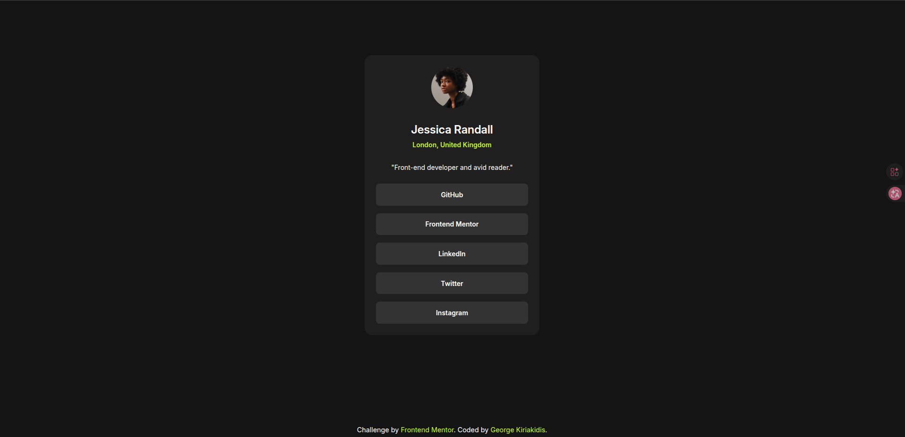

# Frontend Mentor - Social links profile solution

This is a solution to the [Social links profile challenge on Frontend Mentor](https://www.frontendmentor.io/challenges/social-links-profile-UG32l9m6dQ). Frontend Mentor challenges help you improve your coding skills by building realistic projects. 

## Table of contents

- [Overview](#overview)
  - [Screenshot](#screenshot)
  - [Links](#links)
- [My process](#my-process)
  - [Built with](#built-with)
  - [Useful resources](#useful-resources)
- [Author](#author)

**Note: Delete this note and update the table of contents based on what sections you keep.**

## Overview

This is my solution to the [Social links profile challenge on Frontend Mentor](https://www.frontendmentor.io/challenges/social-links-profile-UG32l9m6dQ). Frontend Mentor challenges help you improve your coding skills by building realistic projects. 

### Screenshot

### Links

- Solution URL: [https://github.com/VoRteX16N123/social-links-profile-project/tree/main]
- Live Site URL: [https://vortex16n123.github.io/social-links-profile-project/] 

## My process

### Built with

- Semantic HTML5 markup
- CSS custom properties
- Flexbox
- CSS Grid
- Mobile-first workflow

### Useful resources

- [CSS Reset by Josh Comeau](https://www.joshwcomeau.com/css/custom-css-reset/) - I used this for the CSS reset in my solution.

## Author

- Website - [George Kiriakidis](https://github.com/VoRteX16N123)
- Frontend Mentor - [@VoRteX16N123](https://www.frontendmentor.io/profile/VoRteX16N123)